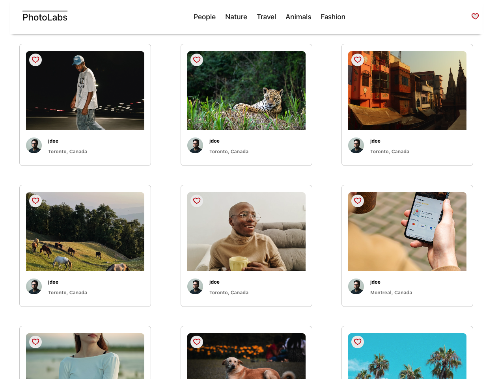
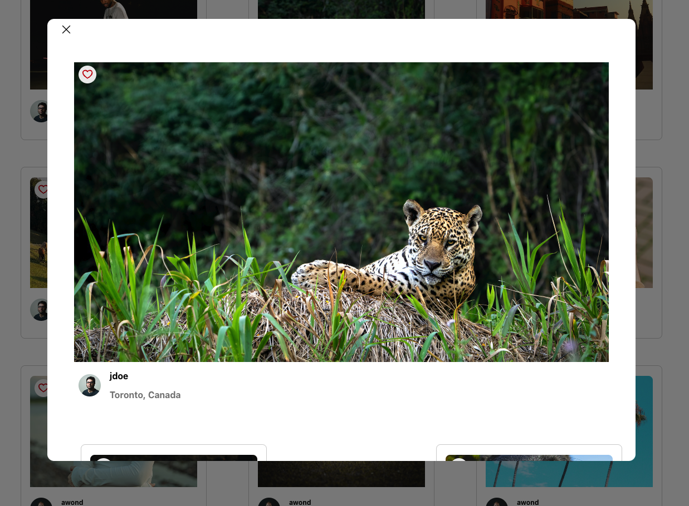
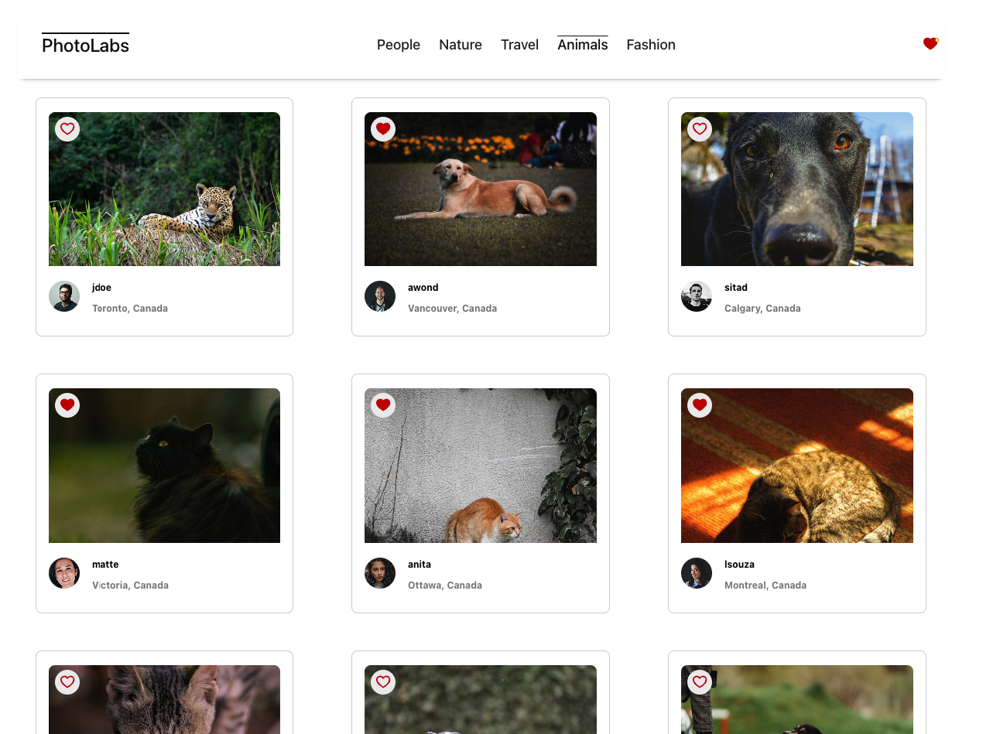

# Photolabs
PhotoLabs is a React-based single-page application (SPA) that allows users to view photos in different contexts. We will use a pre-existing API to build a frontend user experience for users to interact with photos!


# Goal
Build a client-side application using the React view-layer library.
## Requirenments
- The client-side consists of the development of a React single page application (SPA) called PhotoLabs
- The server and persistence layer given as follows:
  - The data layer consists of PostgreSQL database
  - The API server consists of a Node Express.js server application
  - The server/persistence layer may require modifications for stretch goals
- The client will communicate with the API over HTTP using the JSON format

## Behavioural Requirements
1. A user can view photos from the homepage loaded from the API.
2. The user can navigate to different photo categories, also called topics.
3. The user can click on a photo to view a larger version of the photo and relevant / similar photos.
4. The user can like a photo from anywhere within the application where the photo is displayed.
5. The user can view a heart icon with a notification in the navigation if there are liked photos.
6. The navigation will consist of different topics and heart icon.
The client-side application will make API requests to load data.

## Setup

Install dependencies with `npm install` in each respective `/frontend` and `/backend`.

## [Frontend] Running Webpack Development Server

```sh
cd frontend
npm start
```

## [Backend] Running Backend Servier

Read `backend/readme` for further setup details.

```sh
cd backend
npm start
```
## Screenshots






